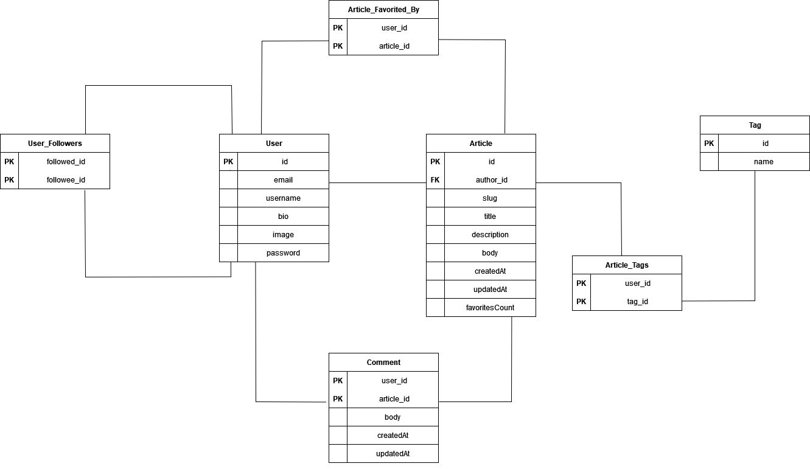

# 

> ### Spring Boot codebase containing real world examples (CRUD, auth, advanced patterns, etc) that adheres to the [RealWorld](https://realworld-docs.netlify.app/docs/specs/backend-specs/endpoints) API spec.

### [Demo](https://demo.realworld.io/)&nbsp;&nbsp;&nbsp;&nbsp;[RealWorld](https://github.com/gothinkster/realworld)

This codebase was created to demonstrate a **Medium.com Clone API** built with **Spring Boot** including CRUD operations, authentication, various entity relations, unit testing, pagination and more.

## How it works

>  **Entity Relationship Diagram**

# 

